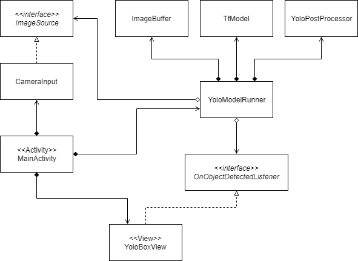

# android_yolo: YAD2K Android Version

## Introduction of the project
Android application detecting objects from camera preview, powered by YAD2K tensorflow model.

## Requirements
* Android Studio
* Pretrained Keras model file
   * yolo.h5 (See references)
   * Python environment with Tensorflow

## How to build
1. Download (or train your own) YAD2K Keras model file
2. Copy the model file into **{project_root}/tf/model_data/**
3. Run **{project_root}/tf/tflite_converter.py** included in the project
4. Copy the generated **{project_root}/tf/model_data/yolo.tflite** into **{project_root}/app/src/main/assets/**
5. Build the application in Android Studio

## Architecture Description of android_yolo

## References
* https://github.com/allanzelener/YAD2K
* https://scm.agreeyamobility.net:8443/shriyash.ingale/YAD2K/tree/master
* https://www.tensorflow.org/lite/convert/python_api
* https://www.tensorflow.org/install
